# transformer-architecture

当本节内容作为第二章 Transformer架构中2.2章节Encoder-Decoder的补充，结合Pytorch的API源码，从Transformer的整体设计上来解释Transformer的各个模块。

## 从经典架构开始：Encoder-Decoder结构
让我们先从经典架构图理解Transformer的整体设计思路。Transformer分为两个主要部分：左侧的编码器（Encoder）和右侧的解码器（Decoder）。那么这两块结构的输入和输出分别是什么？

<div align='center'>
    
    <p>1.jpg</p>
</div>

Encoder的职责是接受完整的源序列输入，将其转换为一个富含语义信息的表示序列。想象一下，如果我们要做机器翻译，Encoder就像是一个深度理解原文的专家，它需要充分理解整个句子的含义、语法结构和上下文关系。

Decoder则承担着更复杂的任务：它需要接受目标序列和编码器输出的表示序列，然后输出词汇/字符的概率分布。这就像是一个翻译专家，既要理解原文的含义（通过Encoder的输出），又要根据已经翻译的部分来决定下一个词应该是什么。

## Positional Encoding：位置编码设计

但这里有一个关键问题需要解决：Transformer本身对位置信息不敏感。比如"我爱你"和"你爱我"这两个句子，在没有位置信息的情况下，模型无法感知到这是语义完全不同的句子。这就像是一个人失去了对词语顺序的感知能力，显然无法正确理解语言。

因此，我们需要一个带有位置信息的向量，将其添加到每个input embedding上，来对不同位置得到不同的表征。这个模块就是图中的**Positional Encoding**。

### 位置编码的设计原则

在设计编码模块时，有**三个重要的前提假设**，这些假设直接影响了最终的实现方案：

**1. 确定性原则**：每个位置的编码应该是确定的数字，不同序列中相同位置的编码应该相同。

为什么这个原则如此重要？让我们考虑一个反例：如果用等分的设计方法，将一个序列从0~1之间做均匀划分，那么序列长度不一样时，每个位置上的编码也就不一样。当序列长度为5时，位置编码可能是0、0.2、0.4、0.6、0.8，但如果序列长度为10，就变成了0、0.1、0.2...。同样对于第二个位置上的字符，在第一个序列中是0.2，在第二个序列中又是0.1，这样的编码就失去了确定性。

**2. 相对关系一致性**：不同句子中，对于任意两个位置之间的相对距离，相对关系应该保持一致。

这个目的是为了学习通用的语言关系，比如："修饰词在被修饰词前1个位置"是通用模式。以下面的长短句举例：

```markdown
- 长句子（10个词）
  位置: 0  1  2  3  4  5  6  7  8  9
  词汇: I  am learning about transformers today in class now

- 短句子（6个词）
  位置: 0  1  2  3  4  5
  词汇: I  like deep learning models
```

在长句子中，位置1和位置4之间的编码关系，应该与短句子中位置2和位置5之间的编码关系完全相同，因为模型需要学会的是通用的相对位置关系。

**3. 泛化能力**：位置序列应该能推广到没见过的更长序列。

第三个假设希望位置编码可以推广到更长的测试句子。假如训练集中序列长度都是10以内的，但测试集中可能会有长度为15的句子，我们希望即使测试集中句子长度更长，在训练中没有见过，我们也能通过这样的position encoding推广过去。

### 三角函数编码

基于这些假设，Transformer采用了sin和cos的组合来表征绝对位置信息：

```markdown
- 向量维度为偶数：PE(pos, 2i) = sin(pos / 10000^(2i/d_model))
- 向量维度为奇数：PE(pos, 2i+1) = cos(pos / 10000^(2i/d_model))
```

通过sin和cos的组合来表征绝对位置的好处是：`pe(pos+k)`可以写成`pe(k)`的线性组合（利用三角函数公式`sin(A + B) = sin(A)cos(B) + cos(A)sin(B)`）。这样做的意义是：即使测试集中出现了pos+k这种未见过的位置，我们也可以把它写成训练集中见过的位置的线性组合，而不用担心测试集中遇到更长的句子无法推广。

### 位置信息的传递机制

但位置编码是在最底层添加，会不会在深层网络中丢失？这个担心是多余的。通过**残差连接**，位置信息能够充分传递到上层网络。

假设有一个N层的神经网络，输入为x₀（包含位置编码），那么：

```markdown
- 第1层: x₁ = x₀ + F₁(x₀)
- 第2层: x₂ = x₁ + F₂(x₁) = x₀ + F₁(x₀) + F₂(x₁)
- 第3层: x₃ = x₂ + F₃(x₂) = x₀ + F₁(x₀) + F₂(x₁) + F₃(x₂)
- ...
- 第N层: xₙ = x₀ + Σᵢ₌₁ⁿ Fᵢ(xᵢ₋₁)
```

可以看到，初始的位置信息x₀始终存在于每一层的输出中，这确保了位置信息不会随着网络层数的加深而消失。

## 从PyTorch源码API来理解transformer的架构设计

通过查看PyTorch的源码，来了解Encoder和Decoder中的架构实现。源码位于`/pytorch/torch/nn/modules/transformer.py`，此次借助的版本是v2.5.1。

### 顶层Transformer类的设计

首先，PyTorch定义了一个顶层的`Transformer`类，我们可以通过`torch.nn.Transformer`来调用它：

```python
# 使用示例
transformer_model = nn.Transformer(d_model=512, nhead=8, num_encoder_layers=6)
```

<div align='center'>
    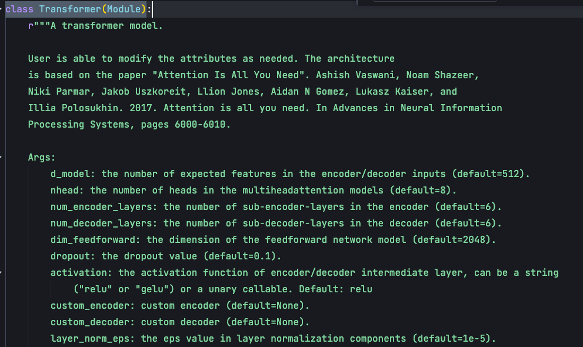
    <p>2.jpg</p>
</div>


在`Transformer`的`__init__`函数中，主要有5个核心参数：

1. **d_model**：整个Transformer的特征维度，在原论文中设置的是512。这个维度需要足够大以承载丰富的语义信息，但太大会导致计算复杂度过高。

2. **nhead**：Multi-head attention的头数目。多头设计的目的是让模型可以捕捉到更多位置与位置之间的关系；

3. **num_encoder_layers**：编码器encoder的block数目，encoder的每个block包含多头自注意力机制和前馈神经网络，这里默认block是6个；

4. **num_decoder_layers**：decoder解码器中block数目，decoder的每个block包含多头自注意力机制、交叉注意力机制以及前馈神经网络；

5. **dim_feedforward**：前馈神经网络层中间的特征维度，默认是2048。Multihead attention输出时，会**首先**映射到2048这个大的特征空间，然后再把它映射回来到512这样的空间。必须要保证输出的维度仍然是512，这样就可以进行残差连接；

<div align='center'>
    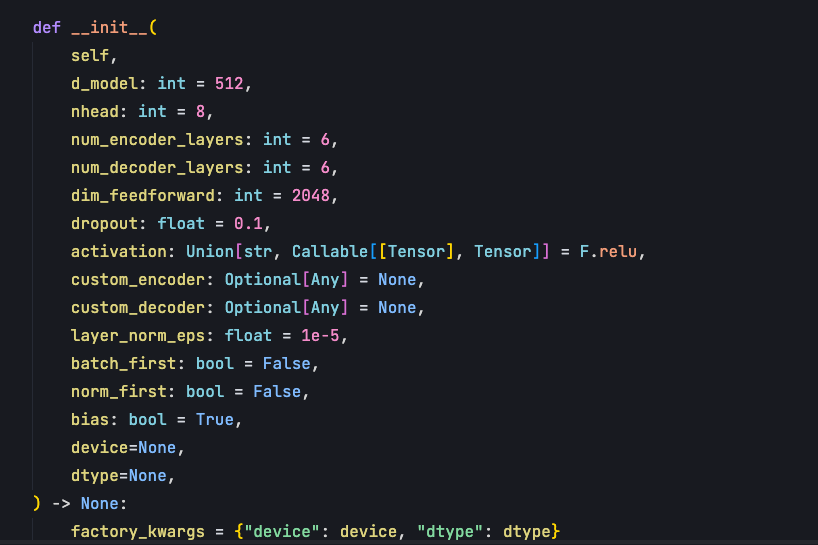
    <p>3.jpg</p>
</div>


### 模块化设计

init函数的作用是实例化模块，第一个要实例化的模块就是encoder。

<div align='center'>
    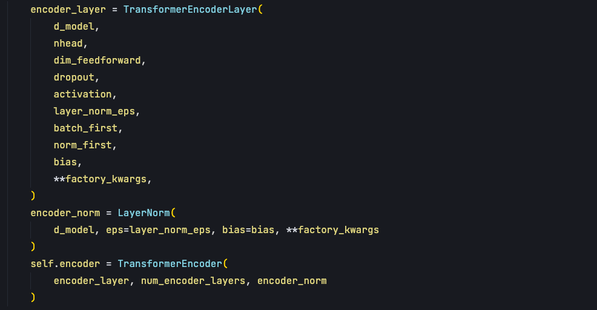
    <p>4.jpg</p>
</div>

encoder通过TransformerEncoder的class去实现实例，在这个class中需要传入encoder_layer，在TransformerEncoderLayer的class中实现了Multihead self attention的调用、残差连接、层归一化、全连接层网络，主要是这些来构成一个encoder_layer。

对于decode部分也是一样，传入decodeLayer参数，这个layer包含了自注意力机制、交叉注意力机制以及前馈神经网络。

<div align='center'>
    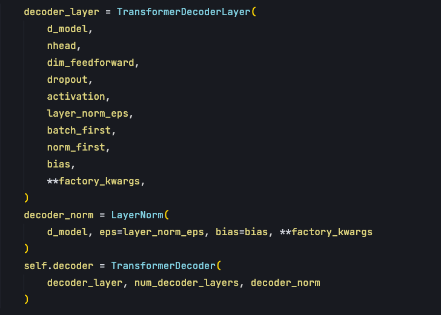
    <p>5.jpg</p>
</div>

总体上Transformer源码，就是由四个class所构成：
- **TransformerEncoderLayer**：每一个编码层的实现
- **TransformerEncoder**：负责把这些编码层串起来
- **TransformerDecoderLayer**：每一个解码层的实现
- **TransformerDecoder**：把这些解码层串起来

这种模块化的设计体现了软件工程的最佳实践：单一职责原则和组合优于继承的思想。

### Forward函数：编排计算流程

在`forward`函数中，Transformer的计算流程非常清晰：

<div align='center'>
    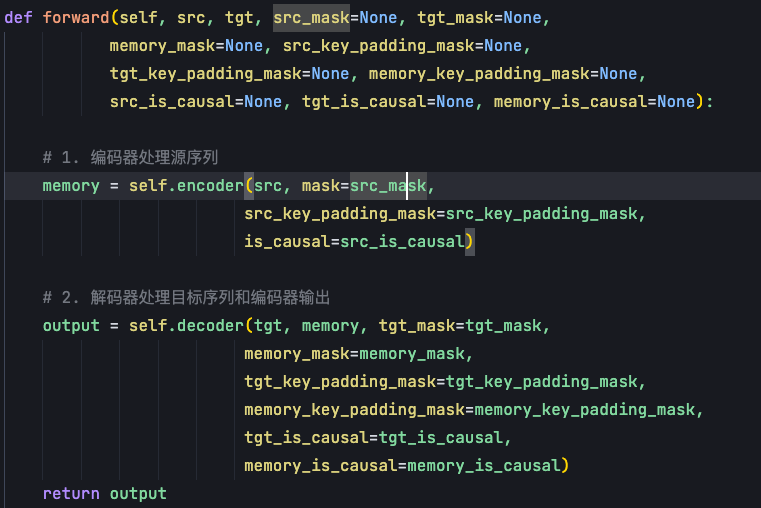
    <p>6.jpg</p>
</div>

首先encoder输入是source句子以及padding_mask，encoder中的注意力机制不需要掩码，因此mask及is_causal参数不需要传入掩码。但需要对样本长度做掩盖，即**padding_mask**，这个mask表示每一个样本的长度。当我们做训练时，序列长度是不一样的，有些短的样本，在后面的一些位置上就是无效的，通过在softmax中把无效位置上的值转成负无穷，这样经过归一化后概率就变成0，使得在这些位置上，这些没有值的位置变得无效。

decode输入第一个是target，也就是目标句子。第二个是memory，表示encoder输出，因为memory会输送到交叉注意力中。第三个是target mask，这个target mask是一个考虑因果的mask，在数学上是一个上三角矩阵。

### 因果掩码mask

每次预测时，decoder都会有一个输入句子，即：output embedding。但这个output embedding不能全部给它，如果全部给它的话，那它就变成了identity映射，相当于从x到x的关系我给你了，那预测出来的答案肯定是从x到x。

我们需要保证output每次只根据当前要预测的单词的左边的所有单词，去预测这个单词。这个单词的本身和其他的右边的单词都不要输送到Output Embedding。这样的操作需要通过mask来实现，随着预测的字符往右进行，我们给到这个decoder中的output会越来越多，所以它就是一个上三角的矩阵。

第四个memory mask，和source sentence的长度有关，在batch训练中source sentence每一个样本都不太一样，memory mask就是每一个输入源序列这个样本的一个长度。

### Transformer框架

这就是Transformer class总体上的构成框架，init函数去实例化encoder和decoder。在forward函数中基于source、target、source mask、target mask，分别入参到encoder和decoder中，最终得到output，即要预测字符的概率。

<div align='center'>
    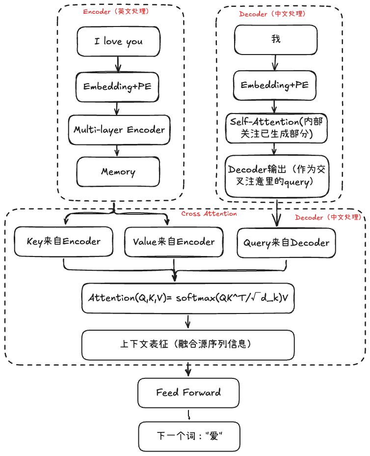
    <p>7.jpg</p>
</div>

Transformer本质上是一个自回归的解码过程，不是并行的预测输出，而是每次只会预测一个，输出一个，然后不断的进行解码去预测出整体的target sentence。

## Encoder编码器层

接下来我们分别来看下init函数中的4个class，首先是**单个编码器**的实现：在`TransformerEncoderLayer`的`__init__`函数中，需要实例化四个关键组件：

<div align='center'>
    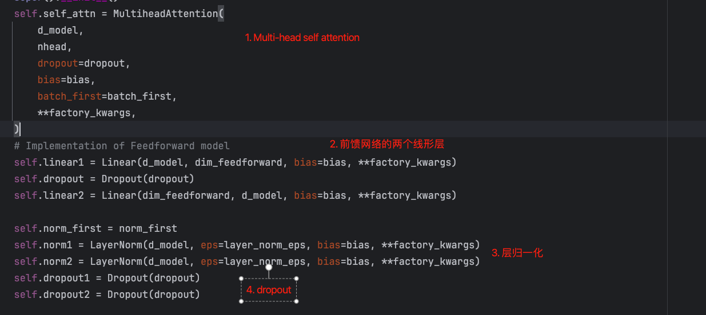
    <p>8.jpg</p>
</div>

先是init函数中的参数，和transformer中传入的一致，d_model是整个Transformer的特征维度512。nhead是Multi-head attention中多头自注意力机制中头的数目。

### 多头注意力的设计

为什么是多头？目的是让**模型可以捕捉到更多的位置与位置之间的关系**。多头会分为多组的query、key和value，每一组会单独地去计算attention的上下文的向量，最后把这个向量拼起来，再通过FFN得到最终的一个向量。

这样做的话，对embedding的特征向量的维度会降低，比如说原来的特征向量维度是512，如果我们分为8个头，这时向量每一个头它向量的维度就会变成64（这里不是通过压缩，而是线性变换重组）。每个头独立计算注意力后，会得到8个64维的输出向量。然后通过拼接操作（concatenation），将这8个64维向量首尾相接，重新组合成一个512维的向量。最后再通过一个输出线性变换层，得到最终的512维输出。

<div align='center'>
    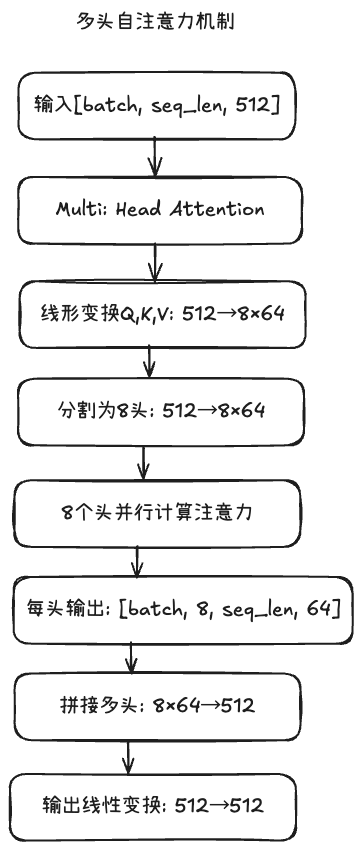
    <p>9.jpg</p>
</div>

### 前馈神经网络

dimension feed forward是前馈神经网络FFN的维度，因为需要先从512到2048，再从2048到512，所以设定了两个全连接层。前馈神经网络它是对每个单独位置进行一个建模，并且不同位置的参数是共享的。类比1×1的pointwise卷积，对图像中每个像素位置的特征向量独立进行变换。参数共享就是为序列中的每个位置都设计相同的参数，目的是希望模型学会"如何处理特征"的通用能力，而不是"如何处理第x个位置的特征"的特定能力。

FFN实际上做的是embedding相同位置不同维度间的融合，在每个位置内部对该位置的不同特征维度进行融合，注意力机制负责位置间的信息交流。

### Encoder编码器层的组件实例化

init函数中需要去实例化一些实例：
1. 首先是Multi-head attention，本节着重整个框架；
2. 实例FFN前馈神经网络中的两个Linear层，第一个Linear比较大，第二个Linear是重新这个投射到d_model的尺度；
3. 实例layer norm，在self attention之后会经过层归一化，以及在前馈神经网络之后也会经过一个层归一；
4. 实例两个dropout，dropout是为了使得这个网络具备集成学习的特点，即使我们在训练多个模提高泛化能力；

### Encoder编码器前向传播forward: 编排计算流程

forward函数中，encoder层的调用很简单。Transformer encoder layer的第一部分：通过self attention block得到一个表征(self._sa_block)，然后再加一个这个残差连接(就是和x加起来)，最后再经过一个层归一化。self attention的输入是序列x和pendding-mask，这里的序列x既充当了query，又充当了key和value。

<div align='center'>
    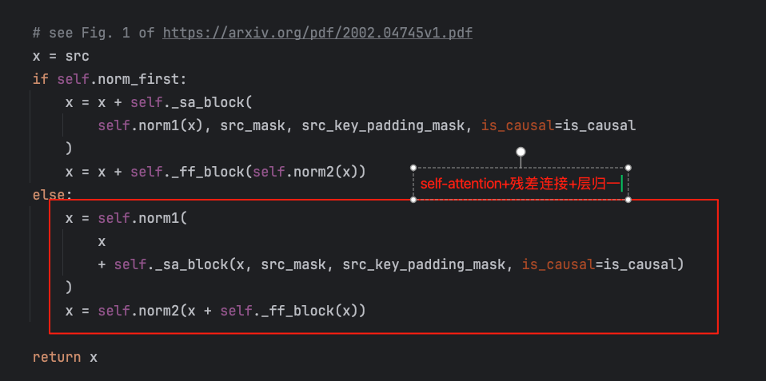
    <p>10.jpg</p>
</div>

第二部分是**feed forward block**，把第一部分输出经过每个位置独立的一个全连接层，再进行一个残差连接，输送到层归一化中就得到x。这个就是Transformer encoder中的每个layer的输出。

原始论文的设计是层归一化在后，即else的设计。

### Encoder编码器的串联

`TransformerEncoder` class的作用是将多个编码器层串联起来：将上一层的输出作为下一层的输入，经过多层处理得到最终的编码器输出。

<div align='center'>
    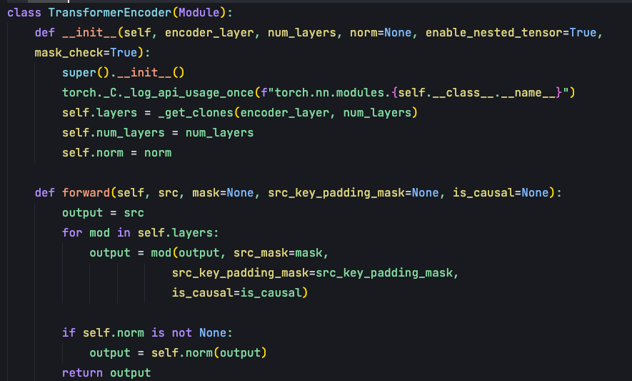
    <p>11.jpg</p>
</div>

init主要是传入两个参数，一个是encoder_layer，表示TransformerEncoderLayer class的一个实例。第二个参数是num_layers，表示transformer encoder有多少层，层的含义就是block。encoder中自注意力机制+前馈神经网络这两块是一个block，也就是一层。

## Decoder解码器

解码器的实现比编码器更复杂，因为它包含三个子模块，需要处理更多的交互。

在`TransformerDecoderLayer`中，我们需要实例化三套组件（**自注意力+交叉注意力+前馈神经网络**）：

<div align='center'>
    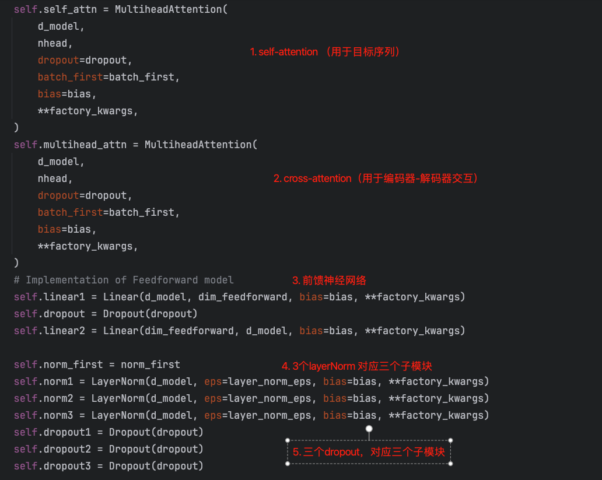
    <p>12.jpg</p>
</div>

在init参数中，第一个是d_model，表示transformer模型特征大小，默认512。第二个参数是nhead，是Transformer decoder的多头自注意力机制的头数。第三个参数是dimension feed forward，表示decoder中FFN前馈神经网络的维度。

<div align='center'>
    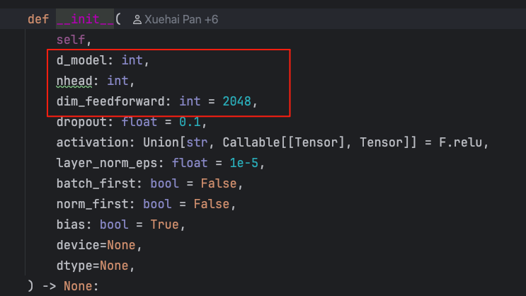
    <p>13.jpg</p>
</div>


### Decoder解码器两种注意力机制的区别

init参数中，decoder和encoder不同的地方，就是需要实例化两个Multihead attention。

第一个Multi-head attention，是**自注意力机制**，它是对decoder这个输入序列的，即：target sentence embedding作为输入序列的自身表征。

第二个Multi-head attention是**交叉注意力机制**，我们想知道decoder multihead attention的输出和encoder输出状态的一个关联性，用该注意力机制跨越了encoder和decoder两个不同序列，不是decoder内部的自我关注，而是让decoder去关注encoder的信息。于是我们通过用decoder MHA（多头注意力）的一个输出作为query，然后用encoder的输出作为key和value来去算出一个上下文表征。

同样Decoder要实现两个Linear层，第一个Linear层是比较大的，把我们交叉自注意力机制的输出，投射到一个更高维的空间，就是2048。然后再把它投射到低维的空间，就是从2048降成512。由于Decoder有三个模块（自注意力+交叉注意力+前馈神经网络），所以这里要实现3个norm和3个dropout。

### Decoder解码器forward：编排流程

解码器的`forward`函数体现了三个模块的协同工作：

1. 第一个模块会把target sentence，也就是序列x和target mask输入到self._sa_block中，对target句子做自注意力机制的计算，结果放入到残差网络中，并且经过层归一化得到输出。

2. 第二个模块依赖于第一个模块输出的x，再和encoder输出的memory做交叉注意力的计算，得到新的表征后，经过残差网络和归一化的norm输出；

3. 把第二个模块的输出输送到FFN前馈神经网络，再次进行残差网络和归一化的norm，得到decoder的输出；

<div align='center'>
    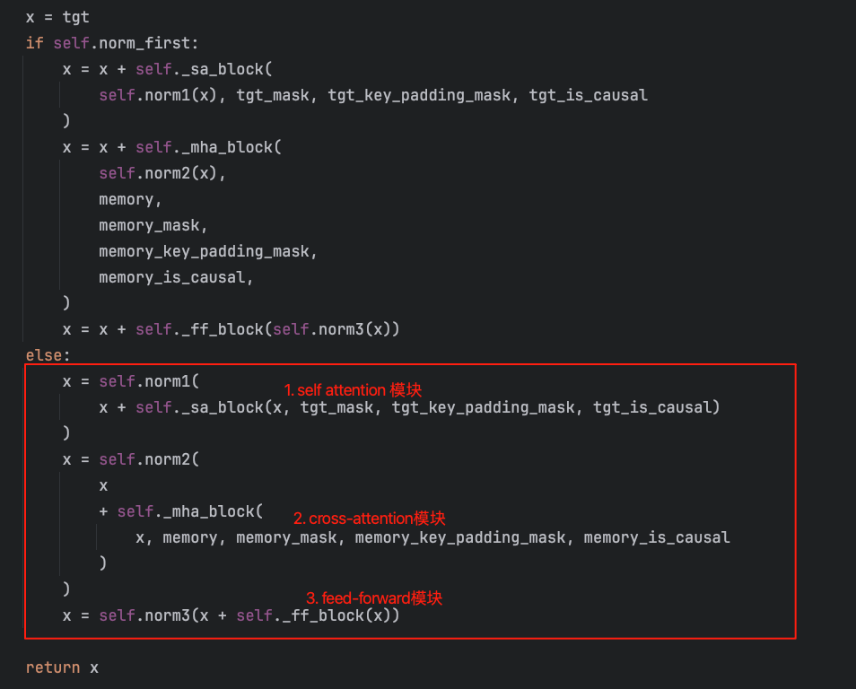
    <p>14.jpg</p>
</div>

可以看下_sa_block和_mha_block各自的调用，它们都是调用的是Multihead attention，只不过它们的query、key、value是不一样的。

<div align='center'>
    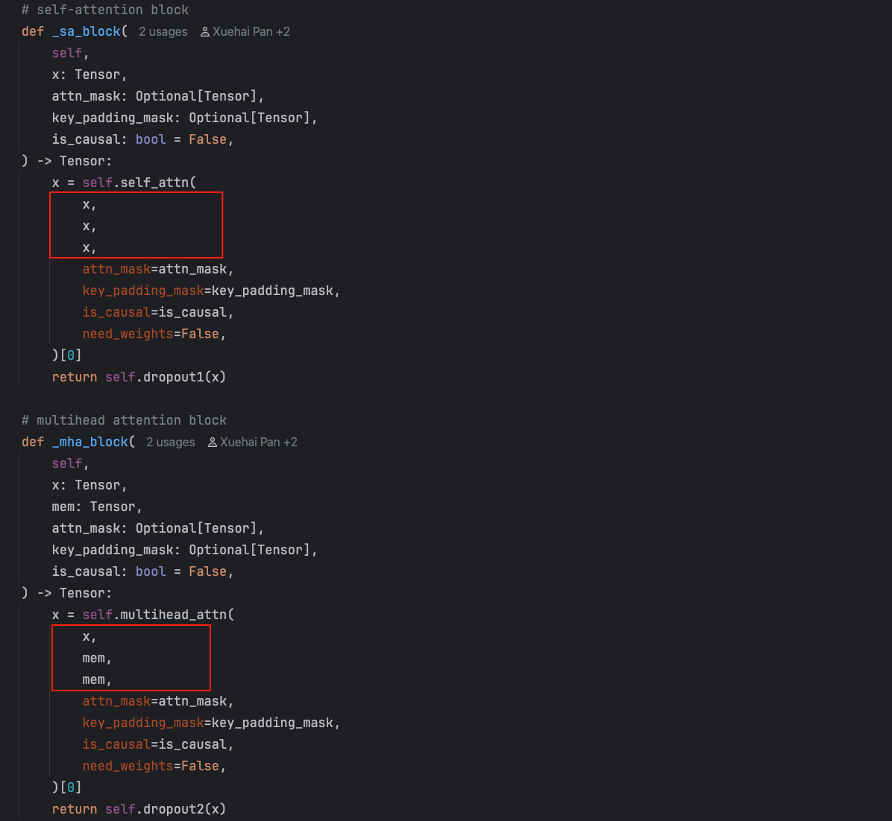
    <p>15.jpg</p>
</div>

<div align='center'>
    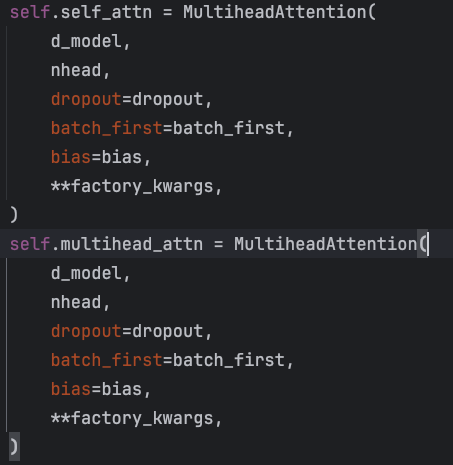
    <p>16.jpg</p>
</div>

self attention中query、key、value都是目标序列，自身对自身的求相关性的计算。但在交叉注意力机制中，query是decoder的一个输出，key和value是encoder的输出（始终是memory）。

通过多个TransformerDecoderLayer，构成了TransformerDecoder，和TransformerEncoder实现类似，这里不重复赘述。

## 注意力机制的核心计算

最后看下注意力机制的核心计算，PyTorch的实际实现更加复杂和优化，但核心思想可以用论文版本来理解：

<div align='center'>
    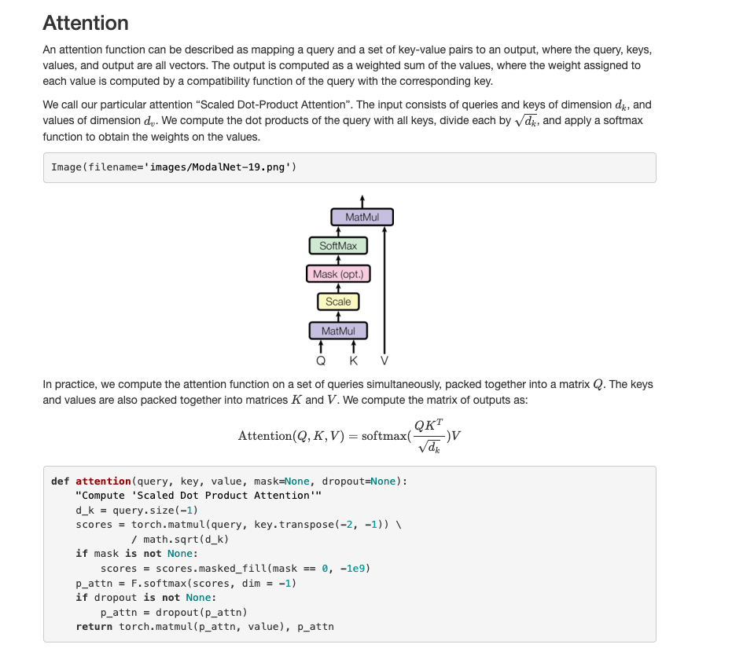
    <p>17.jpg</p>
</div>

### 注意力机制的直观理解

attention函数就是将一个query和一个由key和value形成的一对元素，建立一个连接，最终得到一个输出。比如：我们去百度搜索一个词条，这个词条就是query，然后百度的数据库里有很多词条信息，每个信息自身都有个key，value就是该词条的具体内容。我们通过这个query，百度就会给我们返回一个搜索结果。这个结果就可以理解为一个注意力机制--基于query和key+value计算出来的一个上下文。

注意力机制的计算结果是Value的一个加权求和的结果，权重是基于Query和Key的相似度计算出来的。先算Query和每个Key的相似度，基于这个相似度进行Softmax归一化得到权重，再把这个权重与每个Key所对应的Value进行加权求和。

### Scaled Dot-Product Attention

在Transformer模型中，用的是"Scaled Dot-Product Attention"，这里有个scaled，可以看到公式中就是QK，会除以一个根号d_k，这个目的就是为了使得Softmax的输入分布会更加稳定一点，也就是使得它的方差会更小一点。

这个Attention由三部分构成，分别是Q、K、V，它们都是三个向量。首先我们会把query和key进行一个矩阵相乘，如果我们单个样本来看就是向量内积，批量来看就是矩阵相乘。

内积过后再除以一个根号d_K，把每个位置上的这个内积放到一起去做一个归一化。这样就可以得到每个位置上的一个概率的表示，因为Softmax它出来的结果就是它总和为1，然后每一个值都是在0到1之间，得到这样一个概率，然后我们把概率和每个位置上value进行一个加权求和，最终能得到attention的一个输出，这就是scaled dot product attention的计算逻辑。

论文中讲的Multi-head self attention其实就是有很多个这样的自注意力机制同时计算，算完之后我们把每一个得到的结果给拼起来，得到了Multi-head self attention最终的输出。

### 注意力计算的代码实现

attention代码如下，这里我们用的是论文实现的简单版本。输入由query、key和value构成。

<div align='center'>
    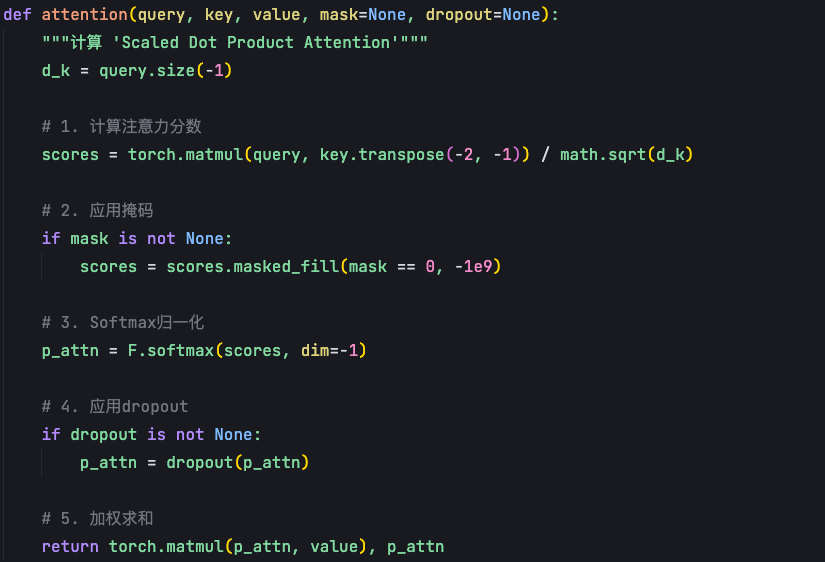
    <p>18.jpg</p>
</div>

首先会把这个q跟k的转置进行一个矩阵相乘，那这样的话就能得到一个一✖️t的向量，把这个向量做一个mask。这里的mask就是把等于0的位置，填充一个非常非常小的一个数，负无穷的数，因为负无穷的数经过Softmax这个归一化之后，它就会变成0的概率，目的是希望那些不重要的位置上的概率赋为0。这里的mask，这里只有一个mask，所以你可以理解为那它这里是一个自注意力机制的一个实现，如果有两个mask，那就是交叉注意力机制的实现。

得到这个p attention就概率分布之后，再把这个p attention跟value进行一个加权求和，得到最终自注意力机制的输出，这是单个自注意力机制的一个计算逻辑，如果是多头的话，最终把单个的输出拼起来就好。

在Transformer模型中，不同的注意力机制有着不同的QKV来源和映射方式：

1. **encoder层的query key和value**：在编码器中都是由word embedding加上position encoding后，通过三个独立的线性映射得到QKV；

2. **在decoder中self attention层**：同样也是通过target sentence embedding+position encoding，通过三个独立的线性映射得到QKV；

3. **在交叉attention中**：query是由decoder的输出经过一个线性映射得到的，key和value是编码器的输出memory分别经过两个映射得到；


**参考资料：**

1. [DataWhale HapplyLLM](https://datawhalechina.github.io/happy-llm/#/)
2. [deep_thought](https://www.bilibili.com/video/BV1o44y1Y7cp/?vd_source=a957a54256d2af7f2a1778751c3855cb&spm_id_from=333.788.videopod.sections)
3. [HandleNLP](https://nlp.seas.harvard.edu/2018/04/03/attention.html)